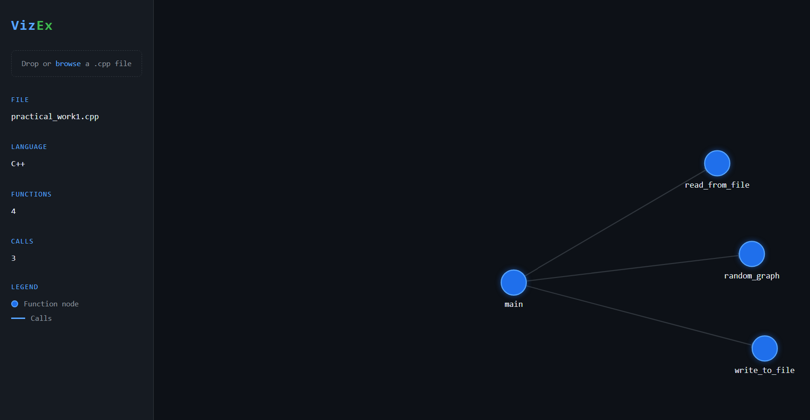

# VizEx
Real-time C++ execution visualizer. VizEx is to Python Tutor what GeoGebra is to Maple.

## Roadmap

**Phase 1 — Usability**
- [x] file upload via browser interface
- [ ] support for classes and methods
- [ ] filter standard library noise
- [ ] improved graph layout for larger files

**Phase 2 — Features**
- [ ] multi-file project support
- [ ] recursive call highlighting
- [ ] call depth filtering
- [ ] UI polish

**Phase 3 — Live execution**
- [ ] GDB/LLDB debugger integration
- [ ] variable state display per step
- [ ] stack frame visualization

**Phase 4 — AI Tutor (VizEx 4.0)**

- [ ] runtime trace monitoring for inconsistency detection
- [ ] bug flagging with visual indicator (red dot) on affected trace nodes
- [ ] opt-in tutor mode triggered by detected inconsistency
- [ ] RAG pipeline on algorithm knowledge base (e.g. Cormen) for grounded suggestions
- [ ] "Did you mean that?" intent inference for celebrity algorithms (Fibonacci, Dijkstra, Floyd-Warshall, etc.)
- [ ] good/bad trace split view for failed cases at high N
- [ ] extend coverage beyond celebrity algorithms based on user data
